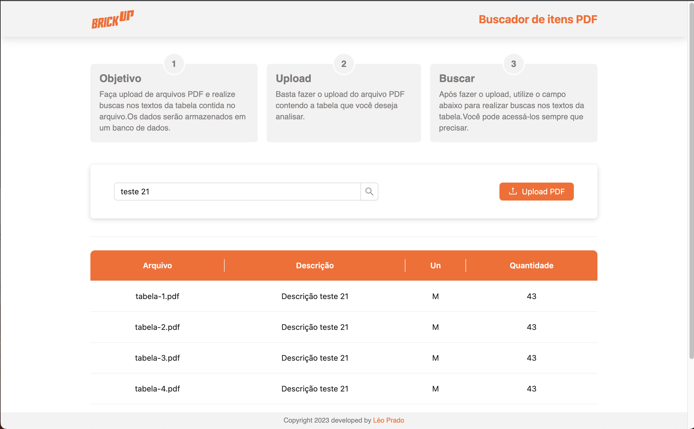

<!-- # :construction: README em construção ! :construction: -->
<div align="center" display="flex" style="padding: 20px 0;">


</div>
<div align="center">
<h1 style="padding-bottom: 20px;">PDF Uploader</h1>


<!-- BADGES W/ LINK (see https://shields.io/)-->
 &nbsp;  &nbsp;  &nbsp;  &nbsp;  &nbsp;  &nbsp;  &nbsp; 
</div>

<hr>
<!-- DESCRIPTION -->

<p style="padding: 10px 0;">
Este é um projeto que permite o upload de arquivos PDF e o armazenamento dos dados da tabela contida no PDF em um banco de dados. Além disso, o sistema possui uma interface web que permite fazer filtros e busca nos textos da tabela.
</p>

<hr>

## 📋 Funcionalidades

* Upload de arquivos PDF para o sistema
* Extração dos dados da tabela contida no PDF
* Armazenamento dos dados em um banco de dados
* Interface web para visualização dos dados
* Busca e filtros nos textos da tabela

<hr>

<!-- INSTALLATION AND USAGE -->

## ⚙️ Instalação e Uso

* Você precisa ter o [node](https://nodejs.org/en/download/) instalado em seu computador para executar este projeto. Este projeto foi criado usando a versão `v16.15.1.`

* Você precisa ter o [docker](https://www.docker.com/products/docker-desktop/) e o [docker compose cli](https://www.docker.com/products/docker-desktop/) instalados em seu computador para executar este projeto. Este projeto foi criado usando as versões `v20.10` e `v1.29` respectivas.

* Você precisa ter o [python](https://www.python.org/downloads/) instalado em seu computador para executar este projeto. Este projeto foi criado usando a versão `v3.11.3`

* Você precisa ter o [Java runtime](https://www.python.org/downloads/) para rodar o pacote `tabula-py`. Este projeto foi criado usando a versão `v1.8.0_371`

<hr>

Para executar esta aplicação, você precisa fazer o clone para seu computador:

```bash
git clone git@github.com:oleoprado/pdf-uploader.git
```

Entre no diretório:

```bash
cd pdf-uploader
```

### **Banco de Dados**
Para subir o container do db:

```bash
docker-compose up -d
```

### **Backend**

Entrar no diretório `backend` e criar um `ambiente virtual`:

```bash
cd backend
```
```bash
python3 -m venv .venv
```

Entrar no ambiente virtual para instalar as dependencias:

```bash
source .venv/bin/activate
```
```bash
pip3 install -r requirements.txt
```

Dentro do ambiente virtual (`.venv`) iniciar o servidor `backend`:

```bash
python3 app/api.py    
```

Estará rodando na porta:
```bash
https://localhost:3333
```

### **Frontend**

Entrar no diretório `frontend` a partir da raiz do projeto:

```bash
cd frontend
```

Instalar as dependencias:

```bash
npm install
```

Configurar a variavel de ambiente no arquivo `.env.example`:

```
http://localhost:3333 (sugestão)
```

Iniciar o servidor do frontend:

```bash
npm run dev
```

Estará rodando na porta:
```bash
https://localhost:5173
```

---

<!-- CONTACT -->

## ✉️ Contato

[](https://github.com/oleoprado/) 


